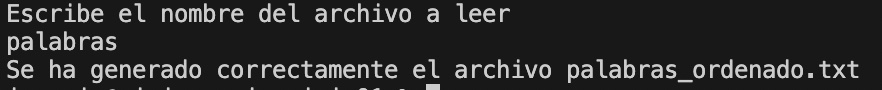

## EJERCICIOS DE FICHEROS

1. Escribe un programa en java que pida un nombre de fichero por teclado. El programa leerá ese archivo que contendrá un texto y mostrará por pantalla sólo las líneas del archivo que contengan la palabra introducida.

2. Escribe un programa en java que pida un nombre de fichero por teclado. El programa leerá ese archivo que contendrá un texto y generará otro fichero con todas las vocales sustituidas por asteriscos y cuyo nombre será el del archivo original añadiendo "_asteriscos" al final.

3. Escribe un programa en java que pida un nombre de fichero por teclado. El programa leerá ese archivo que contendrá una serie de palabras (una por linea) y generará otro fichero con las palabras ordenadas alfabeticamente y cuyo nombre será el del archivo original añadiendo "_ordenado" al final.

  Ejemplo :
  

