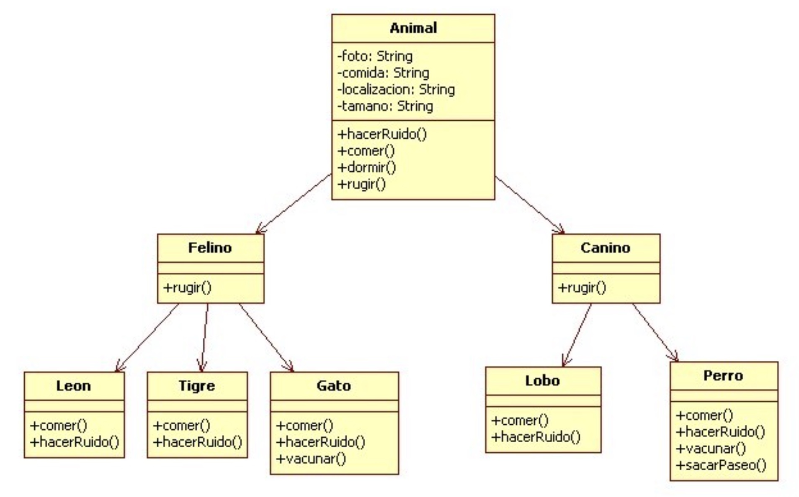

### 1. Empleado

Crea una clase `Empleado` con un método `calcularSalario()` que devuelva el salario base. Luego, crea las subclases `Programador` y `Diseñador` que hereden de `Empleado`. Sobreescribe el método `calcularSalario()` en cada subclase para incluir los beneficios adicionales correspondientes a cada tipo de empleado.

### 2. Fruta

Crea una clase `Fruta` con un método `comer()`. Luego, crea las subclases `Manzana` y `Platano` que hereden de `Fruta`. Sobreescribe el método `comer()` en cada subclase para imprimir un mensaje indicando que se está comiendo la fruta correspondiente.

### 3. Animales

Implementa en java la siguiente jerarquía de clases:

### 4. Figuras
  Define una clase abstracta llamada `FiguraGeometrica` que declare los siguientes métodos:
  
  - `calcularArea()`: método abstracto.
  - `double perimetro()`: Para devolver el perímetro de la figura
  - `void escalar(double escala)`: Para escalar la figura (aumentar o disminuir su tamaño). Solo hay que multiplicar los atributos de la figura por la escala (> 0).
  - `void imprimir()`: Para mostrar la información de la figura (atributos, perímetro y área) en una sola línea.
  
   Luego, crea las subclases `Circulo`, `Triángulo`, `Cuadrado` y `Rectangulo` que hereden de `FiguraGeometrica` e implementa el método `calcularArea()` para calcular el área correspondiente a cada figura.

### 5. Productos

Crea un programa con una clase llamada Articulo con los siguientes atributos: 

  - nombre.
  - precio (sin IVA).
  - iva (siempre será 21, por lo que debe ser una constante).
  - cuantosQuedan (representa cuantos quedan en el almacén).

Añade un constructor con 4 parámetros que asigne valores a nombre, precio, iva y cuantosQuedan. Dicho constructor deberá mostrar un mensaje de error si alguno de los valores nombre, precio, iva o cuantosQuedan no son válidos con las condiciones y excepciones necesarias para determinar si son válidos o no.

Añade a la clase Artículo métodos públicos con las siguientes funcionalidades:

  - Método para imprimir la información del artículo por pantalla.
  - Método getPVP que devuelva el precio de venta al público (PVP) con iva incluido.
  - Método getPVPDescuento que devuelva el PVP con un descuento pasado como argumento.
  - Método vender que actualiza los atributos del objeto tras vender una cantidad ‘x’ (si es  posible). Devolverá true si ha sido posible (false en caso contrario).
  - Método almacenar que actualiza los atributos del objeto tras almacenar una cantidad ‘x’ (si es posible). Devolverá true si ha sido posible (false en caso contrario).

En el main de la clase principal instancia un objeto de la clase artículo. Asígnale valores a todos sus atributos pidiéndolos por teclado y muestra por pantalla un mensaje del estilo 

`Articulo [Pijama - Precio:10€ - IVA:21% - PVP:12,1€]`

 
Prueba a crear varios artículos. Introduce algunos con valores incorrectos para comprobar si avisa del error.

