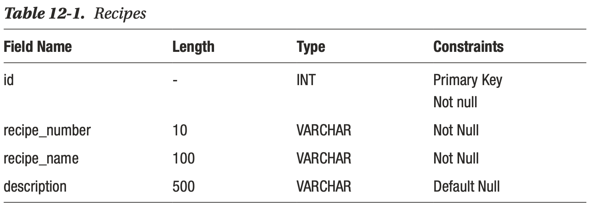
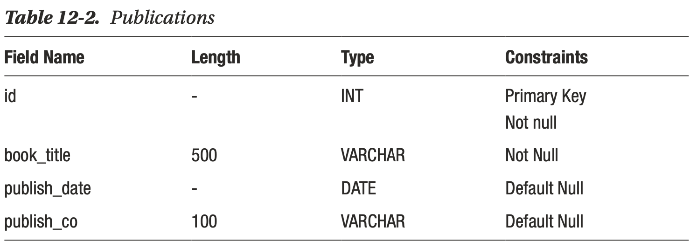
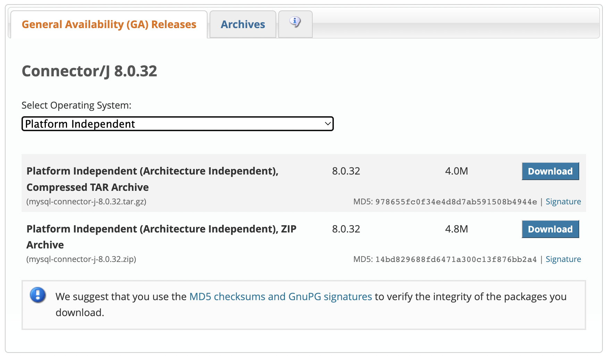
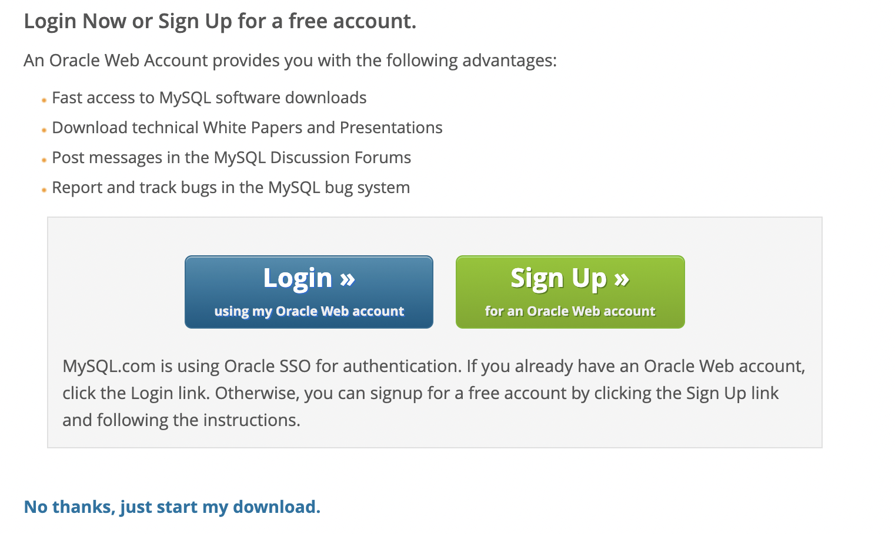
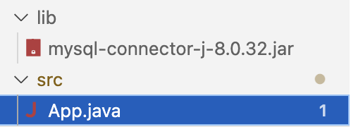

# CONEXIÓN A BASE DE DATOS USANDO JDBC

Una base de datos consiste en datos organizados; es decir, los datos en sí y un esquema que proporciona estructuras de datos. Hoy en día, la mayoría de las bases de datos están organizadas en tablas que consisten en filas y columnas. Esta es una forma natural de organizar los datos, y probablemente estés familiarizado con ellos a través del uso de hojas de cálculo. Puede definir las características de la tabla independientemente de los datos reales que va a almacenar en ella. Un campo es un elemento de datos individual dentro de una tabla que corresponde a la intersección de una fila y una columna. Se pueden especificar una o más columnas como claves únicas para identificar a cada empleado. Para este propósito, puede usar una de las columnas mencionadas anteriormente o la combinación de nombre, apellido y fecha de nacimiento. La clave única utilizada  preferentemente sobre las demás se llama la clave principal o primaria de una tabla.

Casi cualquier aplicación no trivial contiene algún tipo de base de datos. Algunas aplicaciones utilizan una base de datos en memoria, mientras que otras utilizan un sistema tradicional de gestión de bases de datos relacionales (RDBMS). En cualquier caso, es esencial que todos los desarrolladores de Java tengan algunas habilidades para trabajar con bases de datos. A lo largo de los años, la API de conectividad de bases de datos Java (JDBC) ha evolucionado bastante, y en las últimas dos versiones, ha habido algunos avances importantes.

Este capítulo cubre los conceptos básicos del uso de JDBC para trabajar con bases de datos. Aprendes a realizar todas las operaciones estándar de la base de datos y algunas técnicas avanzadas para manipular datos.

## Instalación de MYSQL

Damos por hecho que MySQL está instalado en el equipo, si no es asi, procedemos a instalarlo.

## Creación de la base de datos de muestra

En primer lugar, definimos una base de datos simple llamada apressBooks con dos tablas:  Recipes y publications. El diseño lógico de la base de datos se muestra en la Tabla 12-1 y la Tabla 12-2, caracterizado por el nombre, la longitud, el tipo de datos y las restricciones (es decir, un campo es una clave primaria y otro no debe ser nulo).





Las sentencias SQL para la creación de la base de datos, los permisos y las tablas son las siguientes:

```sql
DROP DATABASE IF EXISTS `apressBooks`;
CREATE DATABASE `apressBooks`;
CREATE TABLE `apressBooks`.`recipes` (
  `id` int NOT NULL AUTO_INCREMENT,
  `recipe_number` varchar(10) NOT NULL,
  `recipe_name` varchar(100) NOT NULL,
  `description` varchar(500) DEFAULT NULL,
  PRIMARY KEY (`id`)
) ;
 
insert into apressBooks.recipes values(1, 
'12-1',
'Installing MySQL',
'Downloading and installation of a MySQL Database'); 
 
insert into apressBooks.recipes values(2, 
'12-2',
'Connecting to a Database',
'DriverManager and DataSource Implementations');

insert into apressBooks.recipes values(3,
'12-3',
'Handling SQL Exceptions',
'Using SQLException');

insert into apressBooks.recipes values(4,
'12-4',
'Querying a Database and Retrieving Results',
'Obtaining and using data from a DBMS');

CREATE TABLE `apressBooks`.`publication` (
  `id` int NOT NULL AUTO_INCREMENT,
  `book_title` varchar(500) NOT NULL,
  `publish_date` date DEFAULT NULL,
  `publish_co` varchar(100) DEFAULT NULL,
  PRIMARY KEY (`id`)
);

insert into apressBooks.publication values (
1,
'Java 17 Recipes',
date('2021-12-01'),
'APRESS');

insert into apressBooks.publication values (
2,
'Beginning Jakarta EE Web Development',
date('2021-04-03'),
'APRESS');


CREATE USER 'usuario3PAW'@'localhost' IDENTIFIED BY 'P@ssw0rd';

GRANT ALL PRIVILEGES ON apressBooks.* TO 'usuario3PAW'@'localhost';

FLUSH PRIVILEGES;
```

## Pasos para la conectividad entre el programa Java y la base de datos

### 1. Importar los paquetes

Para la conexión de Java con la base de datos usamos un objeto de conexión JDBC para obtener la conexión. 

Crear una conexión JDBC implica unos pocos pasos. En primer lugar, debe determinar qué controlador de base de datos necesita. Después de determinar qué controlador necesita, descargue el archivo JAR que contiene ese controlador y colóquelo en su ruta de clase. Cada proveedor de bases de datos proporciona diferentes controladores JDBC empaquetados en archivos JAR con diferentes nombres; consulte

La documentación de su base de datos para obtener más información. Para nuestro caso (Mysql) , se puede descargar el conector en https://dev.mysql.com/downloads/connector/j/. Hay que asegurarse de que la plataforma seleccionada sea "Independiente de la plataforma": esto es importante para distribuir el software en diferentes sistemas. 



En la siguiente ventana pinchamos en el texto: 
> No thanks, just start my download.



obtenemos un archivo comprimido que incluye el archivo "mysql-connector-j-8.0.32.jar", la librería que vamos a importar a nuestro proyecto.

> Podemos descargar el archivo jar [pichando aqui](https://github.com/joaquinalbares/programacion2223/blob/main/UT07/_resources/mysql-connector-j-8.0.32.jar)

Este archivo lo copiamos a la carpeta "lib" de nuestro proyecto, si estamos en VSC.



A continuación, seguimos los siguientes pasos para usar una clase JDBC DriverManager para obtener una conexión a la base de datos.

2. Cargamos los controladores mediante el método forName().
3. Registramos los controladores mediante DriverManager.
4. Establecemo una conexión mediante el objeto de clase Connection.
5. Creamos una instrucción.
6. Ejecutamos la consulta.
7. Cerramos las conexiones.

Analicemos estos pasos brevemente antes de implementarlos escribiendo código adecuado para ilustrar los pasos de conectividad para JDBC.

### Paso 2: Carga de los controladores

Para empezar, primero debe cargar el controlador o registrarlo antes de usarlo en el programa. El registro debe hacerse una vez en su programa. 

Puede registrar un controlador de una de las dos formas que se mencionan a continuación de la siguiente manera: 

#### A) `Class.forName()`

Aquí cargamos el archivo de clase del controlador en la memoria en tiempo de ejecución. No es necesario utilizar objetos nuevos o creados. En el ejemplo siguiente se utiliza Class.forName() para cargar el controlador de Oracle como se muestra a continuación de la siguiente manera:

`Class.forName(“oracle.jdbc.driver.OracleDriver”);`

#### B) `DriverManager.registerDriver()`
DriverManager es una clase incorporada de Java con un registro de miembro estático. Aquí llamamos al constructor de la clase driver en tiempo de compilación. En el ejemplo siguiente se utiliza DriverManager.registerDriver() para registrar el controlador de Oracle como se muestra a continuación:

`DriverManager.registerDriver(new oracle.jdbc.driver.OracleDriver())`

### Paso 3: Establecer una conexión mediante el objeto de clase Connection

Después de cargar el controlador, establezca las conexiones como se muestra a continuación de la siguiente manera:

`Connection con = DriverManager.getConnection(url,user,password)`

Los elementos de esta instrucción son:

- **user**: Username desde el que se puede acceder a su símbolo del sistema SQL.
- **password**: contraseña desde la que se puede acceder al símbolo del sistema SQL.
- **con**: Es una referencia a la interfaz de conexión.
- **Url**: Localizador uniforme de recursos que se crea como se muestra a continuación:
`String url = “ jdbc:oracle:thin:@localhost:1521:xe”`

Donde oracle es la base de datos utilizada, thin es el controlador utilizado, @localhost es la dirección IP donde se almacena una base de datos, 1521 es el número de puerto y xe es el proveedor de servicios. Los 3 parámetros anteriores son de tipo String y deben ser declarados por el programador antes de llamar a la función. El uso de esto puede ser referido para formar el código final.

### Paso 4: Crear una instrucción

Una vez que se establece una conexión, podemos interactuar con la base de datos. Las interfaces JDBCStatement, CallableStatement y PreparedStatement definen los métodos que permiten enviar comandos SQL y recibir datos de la base de datos.
El uso de la instrucción JDBC es el siguiente:

`Statement st = con.createStatement();`

### Paso 5: Ejecutar la consulta

Ahora viene la parte más importante, es decir, ejecutar la consulta. La consulta aquí es una consulta SQL. Ahora sabemos que podemos tener múltiples tipos de consultas. Algunos de ellos son los siguientes:

- Consulta para actualizar o insertar una tabla en una base de datos.
- Consulta para recuperar datos.

El método executeQuery() de la interfaz Statement se utiliza para ejecutar consultas de recuperación de valores de la base de datos. Este método devuelve el objeto de ResultSet que se puede utilizar para obtener todos los registros de una tabla.

El método executeUpdate(sql query) de la interfaz Statement se utiliza para ejecutar consultas de actualización/inserción.


### Código:
Con todo lo visto anteriormente, el código quedaría así:

```java
import java.io.*;
import java.sql.*;

class App {
    public static void main(String[] args) throws Exception {
        // detalles de la conexión (servidor y base de datos)
        String url = "jdbc:mysql://localhost:3306/apressBooks";
        // Credenciales MySQL
        String username = "usuario3PAW";
        String password = "P@ssw0rd";
        // Consulta que vamos a ejecutar
        String query = "select * from publication";
        // Driver que vamos a usar
        Class.forName("com.mysql.cj.jdbc.Driver");
        Connection con = DriverManager.getConnection(url, username, password);
        System.out.println("Conexión Establecida con éxito");
        Statement st = con.createStatement();
        // Ejecutamos la consulta
        ResultSet rs = st.executeQuery(query);
        rs.next();
        // Recuperamos los datos de la tabla
        String name = rs.getString("book_title");
        // Mostramos los resultados por consola
        System.out.println(name);
        // Cerramos la consulta
        st.close();
        // Cerramos la conexión
        con.close();
        System.out.println("Conexión Cerrada....");
    }
}
```

Si queremos seguir el patron MVC, podemos crear una clase específica para la conexión a la base de datos que quedaría así:


```java
package modelo;

import java.sql.Connection;
import java.sql.DriverManager;
import java.sql.SQLException;

public class CrearConexion {

    //Parámetros de la conexión
    private String driver = "jdbc:mysql://";
    private String host="localhost";
    private String port="3306";
    private String database="apressBooks";
    private String user = "usuario3PAW";
    private String password = "P@ssw0rd";

    /**
     * Método para conectarnos a la base de datos
     * @return el ID de la conexión
     * @throws SQLException
     */
    public Connection hazConnection() throws SQLException {
        Connection con = null;

        // Creamos la url para la conexión
        String urlConexion = driver + host + ":" +
        port + "/" + database;

        // conectamos a la base de datos
        con = DriverManager.getConnection(urlConexion, user, password);

		 //devolvemos el identificador
        return con;
    }
}

```
Como vemos, el método creado lanza una excepción en caso de que se produzca un error al conectarse. Un bloque `try-catch` estándar puede detectar excepciones de java.sql.SQLException. Su código no se compilará si no se manejan estas excepciones. Es una buena idea manejarlos correctamente para evitar que nuestra aplicación se bloquee si se lanza una de estas excepciones. 

Es muy recomendable que cuando manejemos objetos java.sql.Connection gestionemos los errores para garantizar que las excepciones de la base de datos se manejen correctamente. A menudo se requieren bloques de `try-catch` anidados para manejar todas las posibles excepciones. Debe asegurarse de que las conexiones se cierren una vez que se haya realizado el trabajo y el objeto Connection ya no se utilice. Del mismo modo, también es una buena idea cerrar los objetos java.sql.Statement para la limpieza de la asignación de memoria.

Debido a que los objetos Statement y Connection deben cerrarse, es común ver que los bloques `try-catch-finally` aseguran que todos los recursos se hayan atendido según sea necesario. Es probable que veas un código JDBC más antiguo que se asemeja al siguiente estilo.

Podemos aprovechar la declaración `try-with-resources`, que permite descargar la gestión de recursos a Java, en lugar de realizar cierres manuales. El siguiente código muestra cómo usar los recursos `try-with-resources` para abrir una conexión, crear una declaración y luego cerrar tanto la conexión como la instrucción cuando haya terminado.

```java
try (Connection conn = createConn.getConnection();
        Statement stmt = conn.createStatement();) {
    ResultSet rs = stmt.executeQuery(qry);
    while (rs.next()) {
        // ACCIONES CON LOS RESULTADOs
    }
} catch (SQLException e) {
    e.printStackTrace();
}
```

